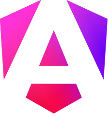

  

# Developer Interview Questions

Modern interview questions and answers for developers.

## Motivation

In many cases, an Internet search gives old content that is no longer relevant.

I wanted to collect a list that is up to date.

**Every link in this file is from 2024.**

## Frontend

- [React.js interview questions and answers for 2024](https://www.turing.com/interview-questions/react-js)
- [20 senior Angular developer interview questions and answers](https://aw.club/global/en/blog/senior-angular-developer-interview-questions)
- [100+ Angular interview questions and answers for 2024](https://www.turing.com/interview-questions/angular)

## Backend

- [Top 100 Node.js interview questions and answers in 2024](https://www.turing.com/interview-questions/node-js)

## License

Please see the [LICENSE file](LICENSE).

## History

I made the first version on 20th June, 2024.
